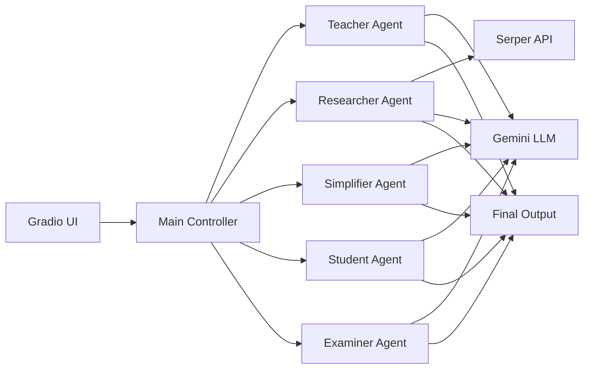

# 🤖 Multi-Agent AI Learning System

### *AI-powered collaborative learning using autonomous agents*


---

## 🚀 Project Overview

This project demonstrates a **production-style multi-agent AI system** where specialized agents collaborate to solve a single problem:
👉 *Delivering structured, high-quality learning for any topic.*

Unlike typical LLM apps that generate a single response, this system:

* Orchestrates **multiple AI agents with distinct roles**
* Combines **reasoning + retrieval + simplification**
* Produces a **complete learning pipeline output**

---

## 🎯 Key Highlights (What Makes This Stand Out)

* 🧠 **Multi-Agent Architecture (CrewAI)**
* 🔄 **Sequential Task Orchestration**
* 🌐 **Real-time Retrieval (RAG via Serper API)**
* 🤖 **LLM Integration (Gemini 2.5 Flash)**
* 🧩 **Role-based AI Design (Teacher, Researcher, etc.)**
* 🎨 **Interactive UI (Gradio)**

👉 This project reflects **real-world AI system design**, not just prompt engineering.

---

## 🏗️ System Architecture



---

## ⚙️ How It Works

| Step | Agent         | Responsibility                            |
| ---- | ------------- | ----------------------------------------- |
| 1    | 👩‍🏫 Teacher | Concept explanation                       |
| 2    | 🔍 Researcher | Real-world insights (via search)          |
| 3    | 📝 Simplifier | Converts to beginner-friendly explanation |
| 4    | ✏️ Student    | Generates structured notes                |
| 5    | 📋 Examiner   | Creates questions + answers               |

👉 Output = **End-to-end learning package**

---

## 💡 Sample Output (What Users Get)

* ✔️ Step-by-step explanation
* ✔️ Real-world examples
* ✔️ Simplified version (ELI5 style)
* ✔️ Revision notes
* ✔️ Practice questions (multi-level)

---

## 🧪 Engineering Depth

### ✅ Multi-Agent Design

* Role-based agent abstraction using CrewAI
* Independent task execution + dependency chaining

### ✅ LLM Orchestration

* Shared LLM across agents
* Context passed between stages

### ✅ Retrieval-Augmented Generation (RAG)

* Researcher agent integrates external knowledge via Serper API

### ✅ Deterministic Flow (Alternative Approach)

* Sequential execution ensures:

  * Better observability
  * Reliable outputs
  * Easier debugging

---

## 🛠️ Tech Stack

| Layer            | Technology       |
| ---------------- | ---------------- |
| AI Orchestration | CrewAI           |
| LLM              | Gemini 2.5 Flash |
| Search           | Serper API       |
| UI               | Gradio           |
| Language         | Python           |

---

## ▶️ Run Locally

```bash
git clone https://github.com/your-username/multi-agent-ai-learning.git
cd multi-agent-ai-learning
pip install -r requirements.txt
python app.py
```

Open:

```
http://127.0.0.1:7860
```

---

## 🔐 Environment Setup

```bash
export GEMINI_API_KEY=your_key
export SERPER_API_KEY=your_key
```

---

## 📌 Design Decisions

* **Why Multi-Agent?**
  Improves response quality by dividing responsibilities

* **Why Sequential Execution?**
  Ensures consistent and traceable outputs

* **Why Separate Roles?**
  Mimics real-world human collaboration model

---

## 📈 Potential Improvements

* Agent memory (context retention)
* Vector DB integration (true RAG pipeline)
* Async execution for performance
* Streaming responses
* Deployment (Docker + Cloud)

---

## 🎯 Ideal Use Cases

* AI-powered EdTech platforms
* Intelligent tutoring systems
* Knowledge assistants
* Interview preparation tools

---

## 👨‍💻 About Me

**Rahul Churhe**
Senior Software Engineer | Android | Flutter | AI Enthusiast

* 10+ years of experience
* Exploring **AI systems & agentic workflows**
* Focused on building **real-world AI applications**

---

## ⭐ Why Recruiters Should Care

This project demonstrates:

* ✔️ System design thinking
* ✔️ Practical AI integration
* ✔️ Multi-agent orchestration
* ✔️ Clean architecture approach
* ✔️ End-to-end product mindset

👉 Not just “using AI” — but **engineering with AI**

---

## 📬 Contact

Feel free to connect for collaboration or opportunities.
